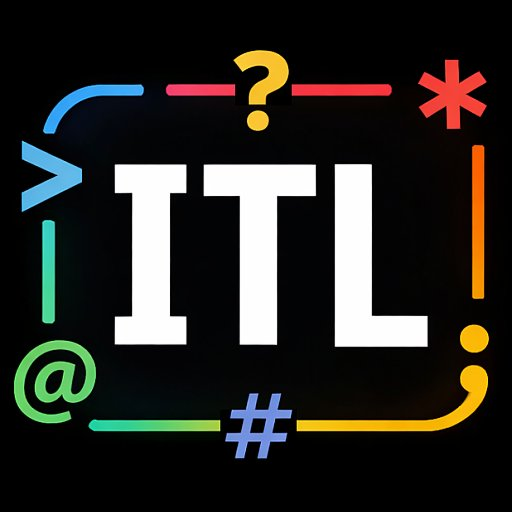

# ITL – Incredibly Tiny Language



ITL is a small, expressive interpreted language freely inspired by **VTL-2** (Very Tiny Language 2, developed by Gary Shannon and Frank McCoy in 1976). Like its ancestor, every line is both a statement and a potential assignment, the program counter is just another variable, and almost every punctuation character has a dedicated meaning. Unlike VTL-2, ITL adds floating-point arithmetic, strings, arrays, a rich math library, screen/color control via PDCurses, and an interactive REPL.

*Prompt Designer:* **Leonardo Boselli** <[leonardo.boselli@youdev.it](mailto:leonardo.boselli@youdev.it)>  
*Programmer*: **Claude Sonnet 4.6** <[https://claude.ai/](https://claude.ai/)>  
*Logo Designer*: **DALL·E 3** <[https://dalle3.ai/](https://dalle3.ai/)>

---

## Quick taste

The usual greeting program:
```
?"Hello, World!\n"
```

This program prints the first 10 squares:
```
N1
?N+" squared is "+(N*N)+"\n"
N+1
#N<11*(#-2)
```

---

## Features

- **27 single-letter variables** – `A` through `Z`, plus `_`
- **Numbers** – IEEE 754 double-precision floats
- **Strings** – variable-length, with `\n \t \r \\` and octal `\nnn` escapes
- **Dynamic array** `@index` – auto-growing, zero-based
- **Math library** – sin, cos, tan, asin, acos, atan, atan2, sinh, cosh, tanh, exp, log, log2, log10, sqrt, cbrt, ceil, floor, round, trunc, abs, sign, pow, fmod, hypot, max, min, pi, e
- **Screen functions** (PDCurses) – gotoxy, putch, getch, setfore, setback, setattr, getw, geth, clear
- **Graphics functions** (WinAPI GDI) – gopen, gclear, gpen, gbr, gpixel, gline, grect, gfillrect, gcircle, gfillcircle, gtext, grefresh
- **Mouse functions** – gmx, gmy, gmb, gmclick, gmdrag
- **Text window mouse functions** – tmx, tmy, tmclick, tmdrag
- **Timing functions** – time, ticks, elapsed
- **Operators** – `+ - * / % ^ & | < > = !` with string concatenation via `+`
- **Interactive REPL** with line numbering, `:help`, `:vars`, `:lines`, `:debug`, `:reset`
- **File execution** – pass a `.it` source file as an argument

---

## Building

### Prerequisites

| Component | Where to get it |
|-----------|----------------|
| GCC (MinGW-w64) | [MSYS2](https://www.msys2.org/) – install `mingw-w64-x86_64-gcc` |
| PDCurses | [pdcurses.org](https://pdcurses.org/) or [GitHub mirror](https://github.com/wmcbrine/PDCurses) |

You need three PDCurses files in the same directory as the source (or on the include/library path): `curses.h`, `panel.h`, `pdcurses.a`

### Compile on Windows with GCC (MSYS2 / MinGW-w64)

```bash
gcc -O3 -I. -o itl.exe itl_interpreter.c pdcurses.a -lmgcc -lgdi32 -luser32
```

### Run

```bash
# Interactive REPL
itl.exe

# Execute a source file
itl.exe myprogram.it
```

---

## Project structure

```
itl_interpreter.c   – interpreter source
README.md           – this file
ITL_MANUAL.md       – full language reference
REPL_GUIDE.md       – guide to the interactive REPL
```

---

## Documentation

* **[ITL_MANUAL.md](ITL_MANUAL.md)** – Complete language reference
* **[REPL_GUIDE.md](REPL_GUIDE.md)** – How to use the interactive REPL

---

## License
[](LICENSE)

This project is released under the **GNU General Public License v3.0**.  
See <https://www.gnu.org/licenses/gpl-3.0.html> for the full text.

**Copyright © 2026 Leonardo Boselli** <[leonardo.boselli@youdev.it](mailto:leonardo.boselli@youdev.it)>

> ITL is free software: you can redistribute it and/or modify it under the terms of the GNU General Public License as published by the Free Software Foundation, either version 3 of the License, or (at your option) any later version.
>
> ITL is distributed in the hope that it will be useful, but WITHOUT ANY WARRANTY; without even the implied warranty of MERCHANTABILITY or FITNESS FOR A PARTICULAR PURPOSE. See the GNU General Public License for more details.
